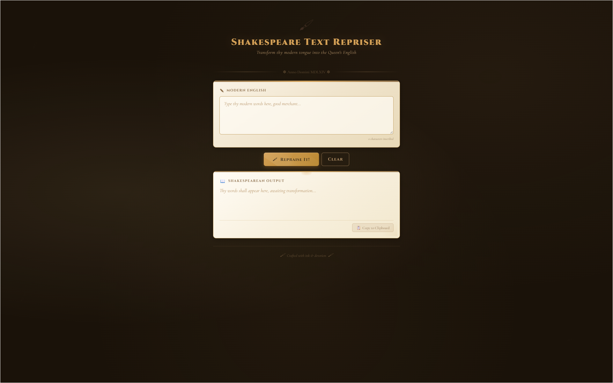

# Shakespeare Text Repriser

Transform modern English into Shakespearean prose with the click of a button.

## Features

- **500+ word replacements** — verbs, adjectives, nouns, emotions, nature, body parts, food, technology
- **Sentence-level transforms** — "I want to" → "mine heart doth long to"
- **Contraction handling** — "don't" → "doth not", "can't" → "canst not"
- **Random Shakespeare quotes** — sprinkled in for dramatic effect
- **Elizabethan insults** — "thou bacon-faced miscreant"
- **Dramatic asides & stage directions** — "[Exit, pursued by a bear.]"
- **Metaphors & similes** — "as swift as Mercury's winged sandals"
- **Sentence inversion** — flips word order for emphasis
- **Parchment-themed UI** — animated quill, gold accents, smooth transitions
- **Copy to clipboard** — works on both local files and HTTPS
- **Zero dependencies** — single HTML file, runs entirely in the browser

## Online Testing

- https://cuber7649.github.io/shakespeare-repriser/shakespeare.html

## Usage

1. Open `shakespeare.html` in any modern browser
2. Type modern English text into the input box
3. Click **Repraise It!**
4. Copy the Shakespearean output

## Examples

| Input                                                              | Shakespearean Output                                                                     |
| ------------------------------------------------------------------ | ---------------------------------------------------------------------------------------- |
| `hello how are you today`                                          | Hark! Hail, how dost thou fare this day?                                                 |
| `I am so happy and excited to see my friend`                       | Verily, I am most merry and filled with mirth to behold my good fellow.                  |
| `omg that is so cool i wanna go to the party tonight`              | Forsooth! That is most excellent and mine heart desireth to hie to the revelry this eve. |
| `why are you so angry with me`                                     | Wherefore art thou so wrathful with me?                                                  |
| `I think the weather is nice today. Maybe I should go for a walk.` | Methinks the firmament is most righteous this day. Perchance I ought to trudge abroad.   |

> **Note:** Output varies each time thanks to random interjections, metaphors, and Shakespeare quotes.

## License

Do what thou wilt.
