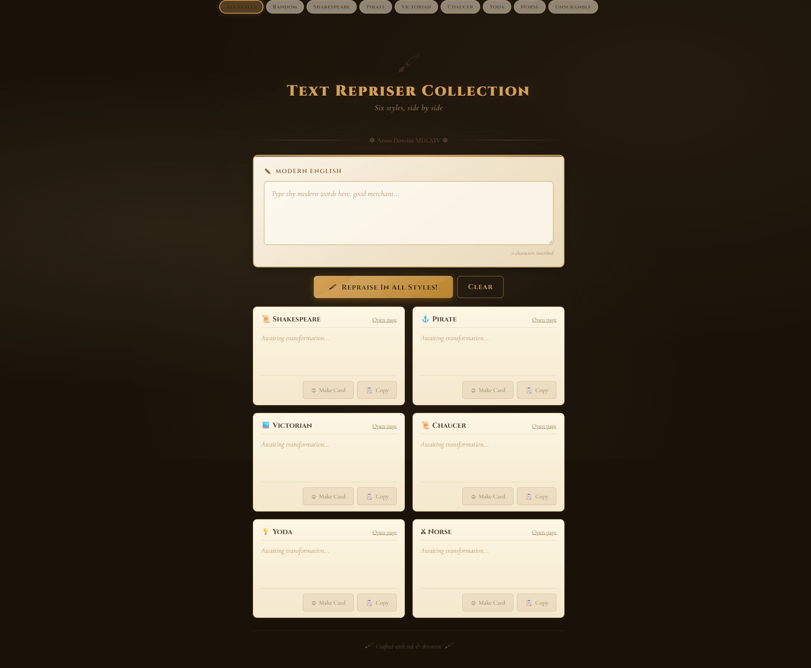

# Text Repriser Collection

A collection of single-page web apps that rewrite modern English into six
literary and historical styles — plus a reverse dictionary that converts
stylized text back to modern English. Everything runs client-side in the
browser. Each page is fully self-contained (bundled word data, CSS, and
JavaScript) with zero dependencies.



## Live Demo

Hosted with GitHub Pages: **[Live site](https://cuber7649.github.io/shakespeare-repriser/)**

| Page | Link |
| ----- | ---- |
| Dashboard (all styles at once) | [Open](https://cuber7649.github.io/shakespeare-repriser/index.html) |
| Shakespeare | [Open](https://cuber7649.github.io/shakespeare-repriser/shakespeare.html) |
| Pirate | [Open](https://cuber7649.github.io/shakespeare-repriser/pirate.html) |
| Victorian | [Open](https://cuber7649.github.io/shakespeare-repriser/victorian.html) |
| Chaucer | [Open](https://cuber7649.github.io/shakespeare-repriser/chaucer.html) |
| Yoda | [Open](https://cuber7649.github.io/shakespeare-repriser/yoda.html) |
| Norse | [Open](https://cuber7649.github.io/shakespeare-repriser/norse.html) |
| Unscramble | [Open](https://cuber7649.github.io/shakespeare-repriser/unscramble.html) |

The site is installable: browsers that support web apps will offer to install
it from `manifest.json`, and iOS users can use Share → Add to Home Screen.

## Styles

| Page | Style | Example |
| ---- | ----- | ------- |
| `shakespeare.html` | Elizabethan English | "how are you" → "How dost thou fare" |
| `pirate.html` | Golden Age of Piracy | "you are my friend" → "Ye be my matey" |
| `victorian.html` | Victorian English | "really" → "Truly"; "you are" → "One is" |
| `chaucer.html` | Middle English | "you are happy" → "Thou art blisful" |
| `yoda.html` | Jedi Master speech | "you are brave" → "Are you brave" (object–subject–verb) |
| `norse.html` | Vikings and Norse myth | "you are happy" → "Ye are merry" |
| `unscramble.html` | Reverse dictionary | "thou art" → "You are" (821 entries) |

## Features

- **Themed word replacement** — hundreds of verbs, adjectives, nouns, and phrases per style
- **Sentence-level transforms** — e.g. "I want to" becomes "my heart hungereth to" (Norse) or "I be yearning to" (Pirate)
- **Contraction handling** — e.g. "don't" becomes "thou dost nat" (Chaucer) or "ye do not" (Norse)
- **Random quotations** — Shakespeare, Austen, the Hávamál, pirate sayings, and Jedi wisdom
- **Themed insults** — e.g. "ye scurvy dog", "thou cherl", "you insufferable bounder"
- **Dramatic asides and stage directions** — e.g. "[The longship sets sail.]"
- **Metaphors and similes** — e.g. "as fierce as a berserker", "as wild as the open sea"
- **Sentence inversion** — reordered syntax for emphasis
- **Style-switcher navigation** — move between styles from any page
- **Side-by-side dashboard** — one input, all six styles at once, on `index.html`
- **Quote card export** — turn any style's output into a shareable 1080×1350 PNG, previewed before you save it. Asides and stage directions are stripped so only the speech appears.
- **Installable web app** — `manifest.json` plus generated icons, no backend
- **Keyboard shortcut** — press Ctrl+Enter to transform
- **Copy to clipboard** — supported on local files and HTTPS, with an announced confirmation
- **Unscrambler** — removes openings, asides, and stage directions, then reverses 821 dictionary entries, including multi-word phrases
- **Responsive layout** — verified from mobile to desktop viewports
- **Screen-reader support** — live regions announce results and copy confirmations; every input has a real label
- **Reduced-motion support** — all decorative animation stops when the OS asks for it
- **Family-friendly content** — all word lists audited; no profanity, slurs, or explicit material, enforced by a test over every line the site can display

## Getting Started

No build step or installation is required.

1. Open `index.html` for all styles at once, or any single style page (start
   with `shakespeare.html`), or use the live demo above.
2. Enter modern English text in the input field.
3. Click the transform button, or press **Ctrl+Enter**.
4. Copy the result with the **Copy to Clipboard** button.
5. To reverse stylized text, paste it into `unscramble.html` and click **Unscramble!**

> `index.html` is a generated file. Editing it directly will be overwritten the
> next time the dashboard is rebuilt; change a style page instead.

## Examples

| Input | Style | Output |
| ----- | ----- | ------ |
| `hello how are you today` | Shakespeare | Hail how dost thou fare this day |
| `hello how are you today` | Pirate | Ahoy how be ye today |
| `hello how are you today` | Chaucer | Hail how fareth thou today |
| `hello how are you today` | Norse | Hail how fare ye this day |
| `I am so happy to see my friend` | Pirate | I be so jolly to spy my matey |
| `I am so happy to see my friend` | Chaucer | I am so blisful to seen my freend |
| `we will travel tomorrow and find the treasure` | Victorian | We will journey the morrow and come upon the treasure |
| `we will travel tomorrow and find the treasure` | Norse | We will journey the morrow and come upon the treasure |
| `you are brave` | Yoda | Are you brave |
| `thou art happy` | Unscramble | You are happy |

> These are single runs. Output varies each time — openings, interjections,
> metaphors, alliterations, asides and stage directions are all rolled at
> random, so `"hello how are you today"` might equally come out as
> `"Hail how as I live dost thou fare this day"`.

## Project Structure

```text
shakespeare-repriser/
├── index.html         # Dashboard: all six styles side by side (generated)
├── shakespeare.html   # Elizabethan style (original page)
├── pirate.html        # Pirate style
├── victorian.html     # Victorian style
├── chaucer.html       # Middle English style
├── yoda.html          # Yoda speech style
├── norse.html         # Norse style
├── unscramble.html    # Reverse dictionary
├── manifest.json      # Web app manifest, for installability
├── icon-180.png       # App icons (generated)
├── icon-192.png
├── icon-512.png
├── README.md
└── Screenshot.png
```

Each `.html` file is a standalone app: open it directly in a browser or serve the
directory with any static file server. There are no shared runtime files.

Two files here are **generated** rather than hand-written:

- **`index.html`** — the side-by-side dashboard. It is the one page that needs
  every dictionary in a single file, so it is built from the six style pages by
  copying each page's dictionaries, engine, helpers and transform function
  verbatim. That keeps this repository free of shared runtime files while making
  it impossible for the dashboard to drift from the individual pages.
- **`icon-*.png` and `manifest.json`** — drawn programmatically, so there is no
  image editor in the loop and the icons are square and maskable-safe.

The generator and test scripts are kept outside this repository. If you change a
style page, the dashboard needs rebuilding; the build tooling is not published
here, so get in touch if you need it.

## Browser Support

Works in all modern browsers (Chrome, Edge, Firefox, Safari), on desktop and mobile.
An internet connection is only needed for the Google Fonts stylesheets; the apps
fall back to system serif fonts when offline.

## License

Do what thou wilt.
